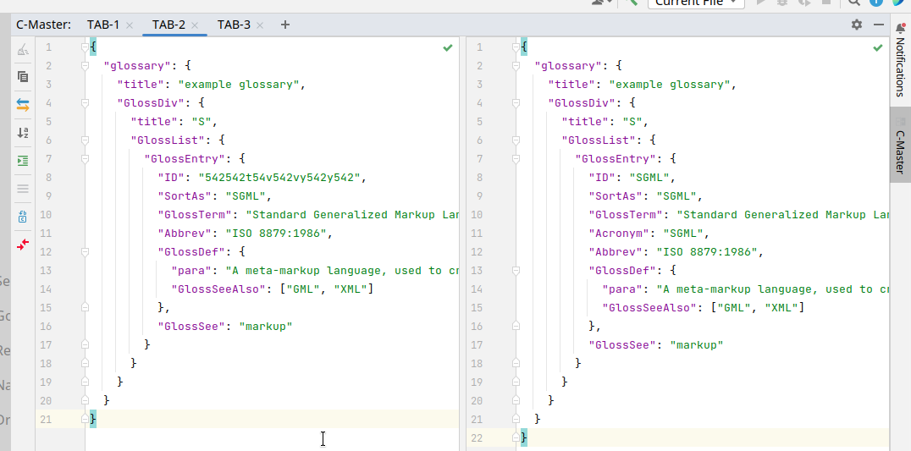
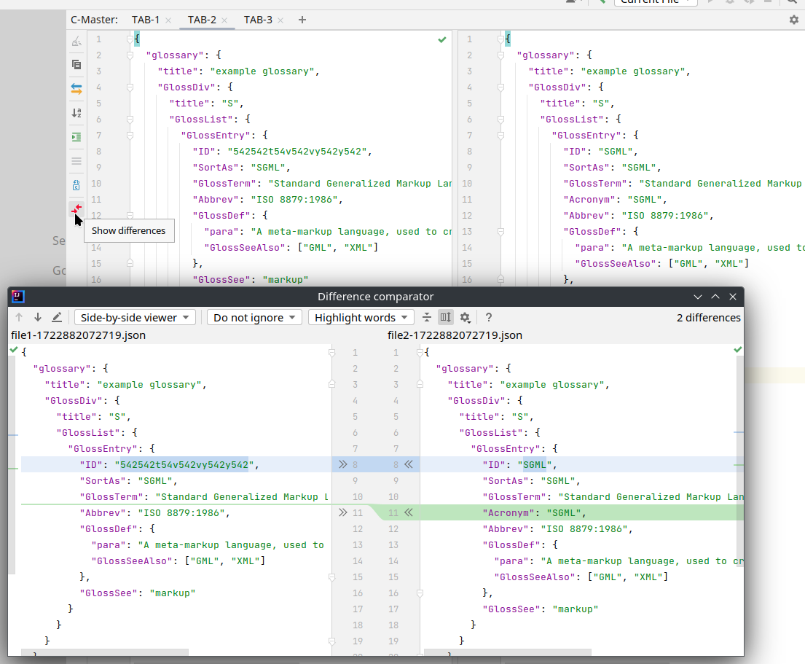
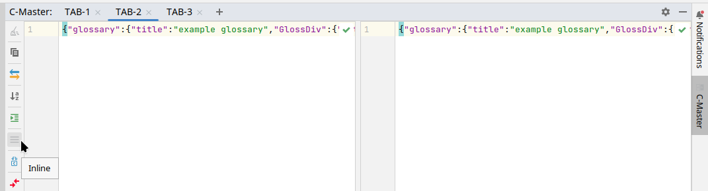
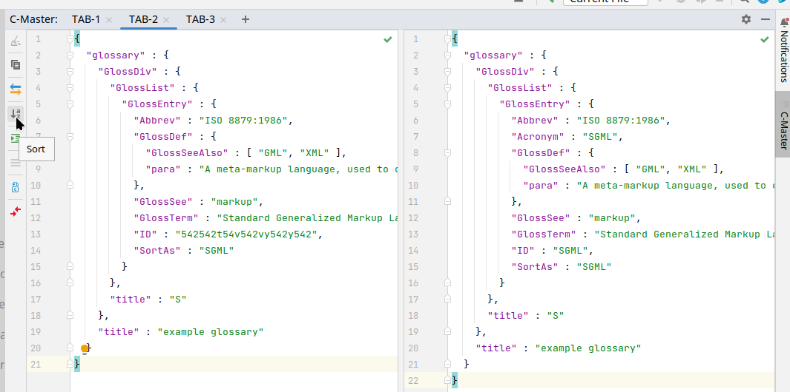
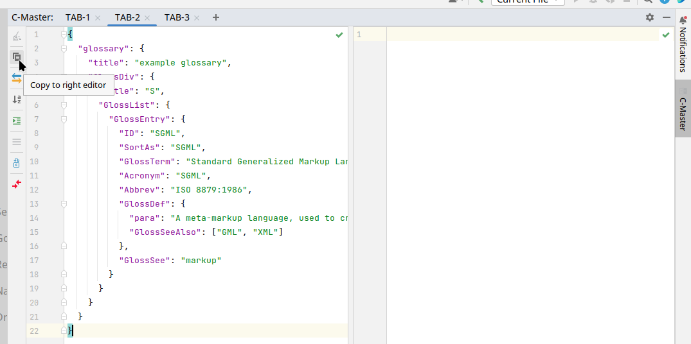

# CompareMaster  

### [Jet Brains IDE plugin](https://plugins.jetbrains.com/plugin/23890-comparemaster) for JSON and XML processing and comparison.

#### Compatible with:

+ Android Studio, 
+ AppCode, 
+ Aqua, 
+ CLion, 
+ Code With Me Guest, 
+ DataSpell, 
+ DataGrip, 
+ JetBrains Gateway, 
+ GoLand, 
+ IntelliJ IDEA Ultimate, 
+ IntelliJ IDEA Community, 
+ JetBrains Client, 
+ MPS, 
+ PhpStorm, 
+ PyCharm Professional, 
+ PyCharm Community, 
+ Rider, 
+ RubyMine, 
+ RustRover, 
+ WebStorm, 
+ Writerside

----------------------
### Structure
Plugin is constructed as a tool window with 2 editors. 

Editors implemented from Intellij-based components, so usual 'search', 'replace',
or any other actions and shortcuts applied to IDEA editors, as well as JSON, XML syntax check, will also work with plugin editors.

 

